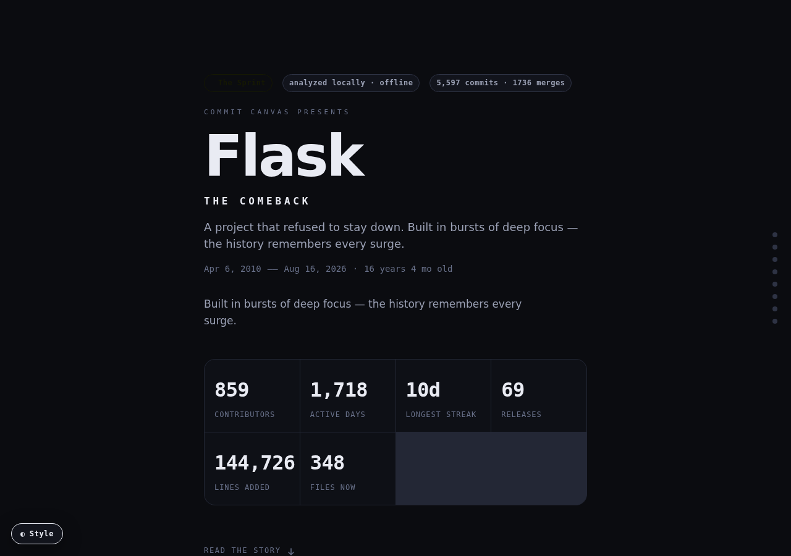
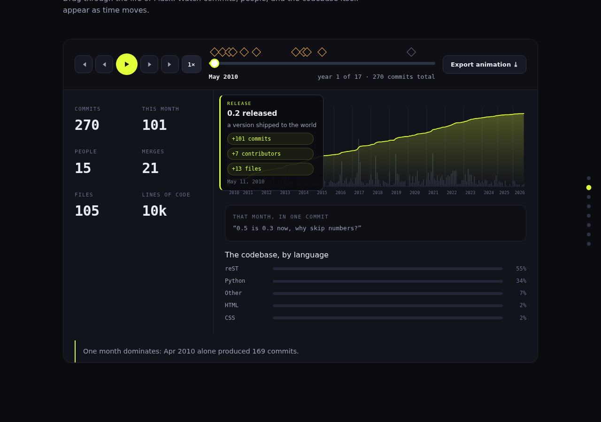
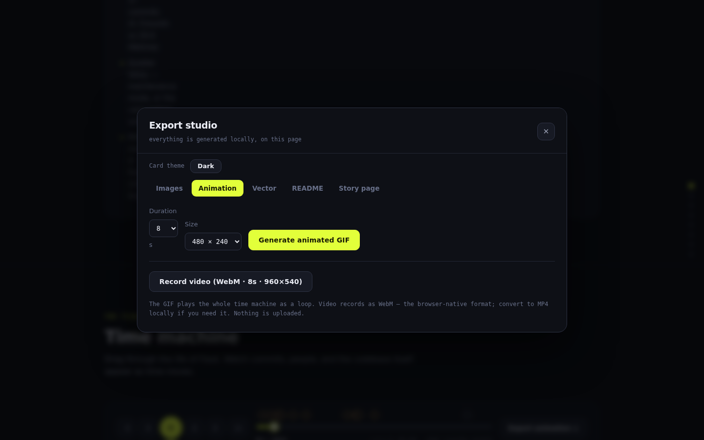
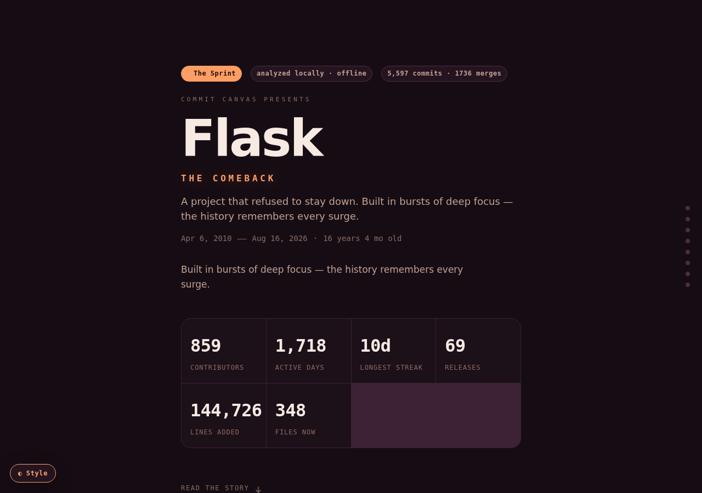
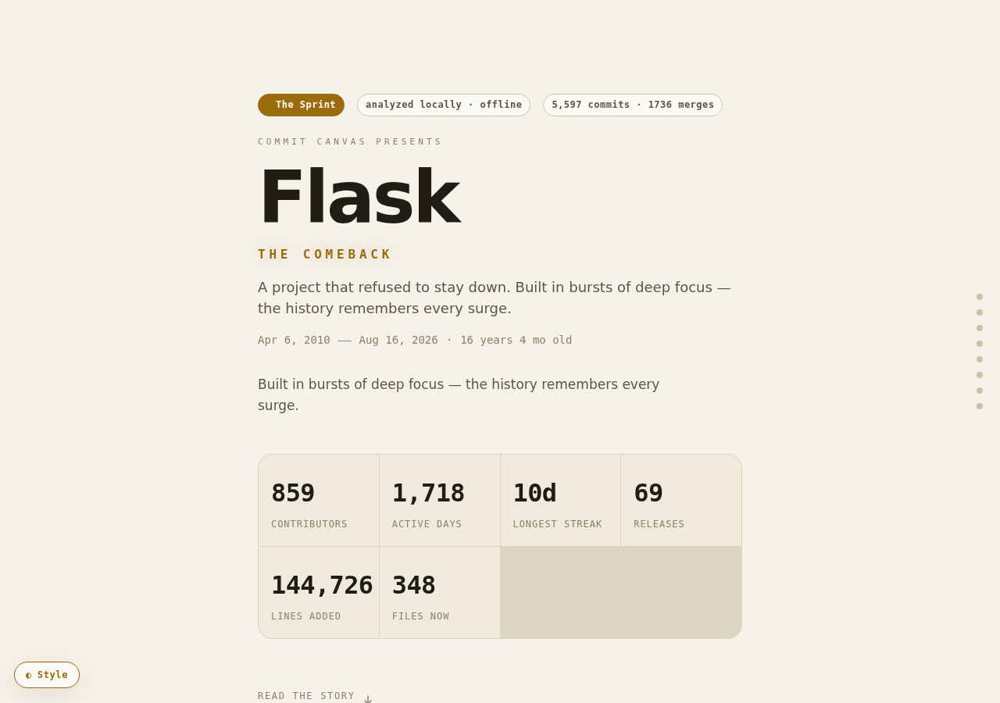
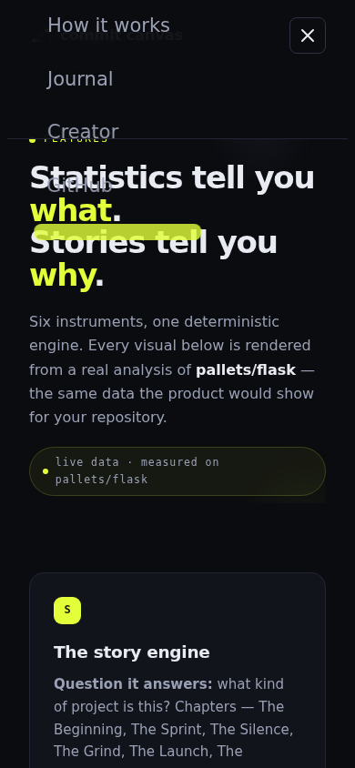
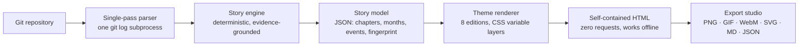
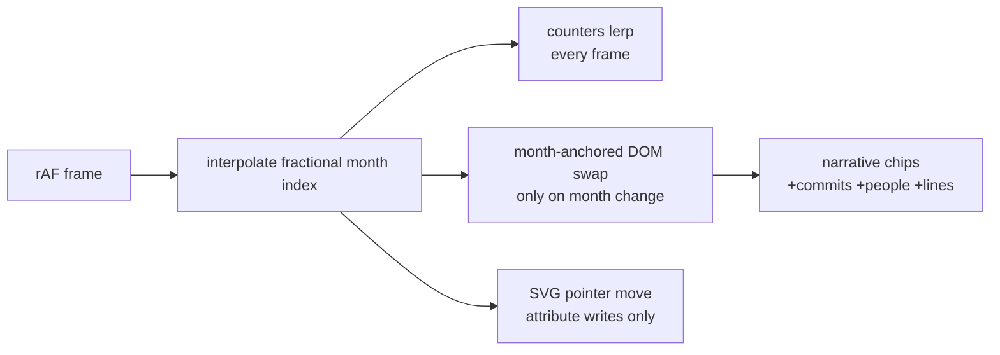

<div align="center">


# COMMIT CANVAS

**Your code has a story. Show it.**

Turn any git repository into a cinematic, animated, shareable story —
chapters, a time machine, themes, and a developer fingerprint.
One command. One file. Zero cloud.

[](https://github.com/ahmadrrrtx/commit-canvas/actions/workflows/test.yml)
[](https://www.python.org)
[](LICENSE)
[](https://github.com/ahmadrrrtx/commit-canvas/stargazers)

**[★ Star on GitHub](https://github.com/ahmadrrrtx/commit-canvas)** · **[Live demo →](https://ahmadrrrtx.github.io/commit-canvas/)** · **[Flask's story →](https://ahmadrrrtx.github.io/commit-canvas/demo/flask-story.html)**

</div>

---



> *"I didn't know my Git history could look like this."*

---

## What is Commit Canvas?

Commit Canvas reads a repository's entire git history and renders it as a **self-contained interactive story page** — a single HTML file with zero external requests:

- **Story engine** — real narrative chapters: The Beginning, The Sprint, The Silence, The Comeback… derived from velocity, gaps and releases, never invented
- **Time machine** — scrub or autoplay the project's whole life with milestone ticks, smart pacing and keyboard controls
- **Project pulse** — the entire history as one signature heartbeat line
- **Developer fingerprint** — building rhythm and archetype (Night Builder, Weekend Sprinter…) from real timestamps
- **Themes** — 8 visual editions: Midnight, Neon, Paper, Terminal, Aurora, Blueprint, Mono, Sunset
- **Export studio** — PNG share cards, animated GIF, WebM video, SVG, Markdown, JSON

It works on **any** git repository — GitHub, GitLab, Bitbucket, Gitea, or a folder no server has ever seen.

## Why?

GitHub shows metrics. Gource shows animations. GitStock shows the last 100 commits. Commit Canvas focuses on the thing none of them do: **the story**. Read the full reasoning in *[Why Commit Canvas?](https://ahmadrrrtx.github.io/commit-canvas/journal/why-commit-canvas/)* and a factual comparison in *[How it's different](https://ahmadrrrtx.github.io/commit-canvas/compare/)*.

## Demo

- **[Landing page + live generator](https://ahmadrrrtx.github.io/commit-canvas/)** — paste any public GitHub URL
- **[Flask's story](https://ahmadrrrtx.github.io/commit-canvas/demo/flask-story.html)** — 16 years, 5,597 commits, 859 contributors
- **[Commit Canvas' own story](https://ahmadrrrtx.github.io/commit-canvas/demo/commit-canvas-story.html)** — the tool telling its own story

## Screenshots

| Time machine | Export studio |
| --- | --- |
|  |  |

| Sunset edition | Paper edition | Mobile |
| --- | --- | --- |
|  |  |  |

## Quick start

```bash
git clone https://github.com/ahmadrrrtx/commit-canvas
cd commit-canvas
./run.sh .                       # your current project
./run.sh /path/to/any/repo       # any repository, any host, private included
./run.sh . --theme sunset        # pick a visual edition
./run.sh . --density cinematic   # compact · standard · cinematic
./run.sh . --open                # open in browser after
./run.sh . --json model.json     # also export the raw analysis model
```

Or install it properly:

```bash
pip install commit-canvas
commit-canvas /path/to/repo --theme neon
```

**Web version (zero install):** paste a public GitHub URL on [the website](https://ahmadrrrtx.github.io/commit-canvas/) — analysis runs in your browser via GitHub's public API; nothing is uploaded anywhere.

## Usage

```
commit-canvas [repo_path] [options]

  -o, --output PATH       output HTML path (default ./story.html)
      --title TITLE       custom project title
      --theme NAME        midnight · neon · paper · terminal · aurora · blueprint · mono · sunset
      --density LEVEL     compact · standard · cinematic
      --max-commits N     analyze only the N most recent commits
      --json PATH         also write the raw analysis model as JSON
      --open              open the result in your browser
```

Themes and density can also be changed **inside** the generated story (◐ Style button, bottom-left) — the analysis is never re-run; presentation is a separate layer.

## Architecture



**How it works, in one paragraph:** the analyzer makes exactly one `git log` subprocess call (NUL-separated fields, merge-safe, Unicode-safe), builds a story model in pure Python, and injects it into an HTML shell that inlines the renderer, the theme system, the GIF encoder and the export studio. The output file is fully standalone — open it from a USB stick in a decade and it will still work.

**Time machine architecture:** playback runs on a single `requestAnimationFrame` loop; counters interpolate between months every frame while month-anchored content swaps only when the month actually changes. Playback slows near milestones so important moments get screen time. No framework, no virtual DOM, no per-frame reflow storms.



## Supported git data

Commits (dates, authors, messages, hashes) · merge topology · tags/releases · per-file line additions/removals · file counts · languages (by extension) · directory activity. Everything is derived from the local `.git` directory — no network, no telemetry, no accounts.

## Configuration

Everything has working defaults; the most common knobs:

| Option | Values | Effect |
| --- | --- | --- |
| `--theme` | 8 editions | Visual identity of the story |
| `--density` | compact / standard / cinematic | Section depth and spacing |
| `--title` | any string | Overrides the repo name |
| `--max-commits` | N | Cap analysis for huge histories |

## Examples

- [Flask (16 years, massive team)](https://ahmadrrrtx.github.io/commit-canvas/demo/flask-story.html) — *The Movement*
- [Commit Canvas itself](https://ahmadrrrtx.github.io/commit-canvas/demo/commit-canvas-story.html) — *The Comeback*
- More on the [examples page](https://ahmadrrrtx.github.io/commit-canvas/examples/)

## Roadmap

- [x] v1.0 — story page, CLI
- [x] v2.0 — one renderer, CLI + web, rebuild
- [x] v2.1 — export studio, time machine v2, project website
- [x] v3.0 — themes, pulse, archetypes, density, comparison research
- [ ] v3.x — more themes, story presets, contributor-focused editions

## Contributing

PRs welcome — see [CONTRIBUTING.md](CONTRIBUTING.md). The codebase is deliberately small and readable: `cc/analyzer.py` (analysis), `cc/story.py` (assembly), `web/app.js` (renderer), `web/story.css` (design system). [Report issues here](https://github.com/ahmadrrrtx/commit-canvas/issues).

## Security

See [SECURITY.md](SECURITY.md) — short version: the CLI never makes network requests, untrusted commit metadata is escaped before embedding, and generated HTML is safe to open locally.

## License

[MIT](LICENSE) © Muhammad Ahmad

## Creator

Built by **[Muhammad Ahmad](https://ahmadrrrtx.github.io/commit-canvas/creator/)** — [GitHub](https://github.com/ahmadrrrtx) · [LinkedIn](https://www.linkedin.com/in/ahmadrrrtx) · [DEV](https://dev.to/ahmad_rrrtx) · [Medium](https://medium.com/@ahmadrrrtx333) · [Hashnode](https://hashnode.com/@ahmadrrrtx) · [Indie Hackers](https://www.indiehackers.com/ahmad_rrrtx) · [daily.dev](https://daily.dev/ahmadrrtx)
